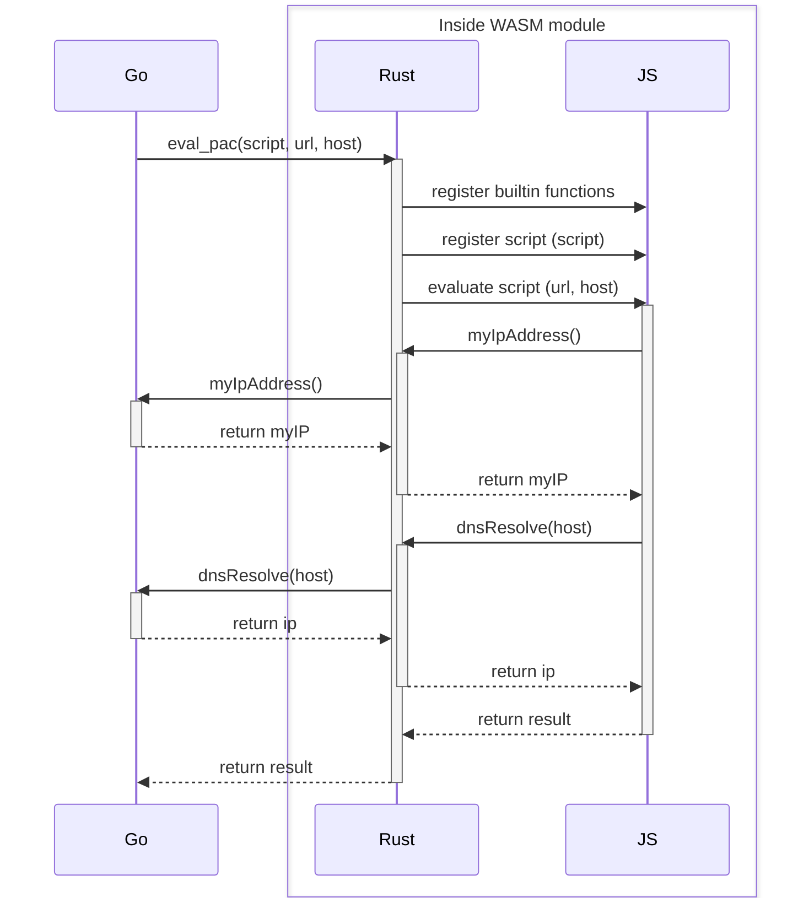

wasmpac
===

`wasmpac` is an experimental sandboxed evaluator for
[Proxy Auto-Config (PAC)](https://developer.mozilla.org/en-US/docs/Web/HTTP/Proxy_servers_and_tunneling/Proxy_Auto-Configuration_PAC_file) files.

> A Proxy Auto-Configuration (PAC) file is a JavaScript function 
> that determines whether web browser requests (HTTP, HTTPS, and FTP) 
> go directly to the destination or are forwarded to a web proxy server.

Since PAC files are JavaScript, the evaluation of a PAC file requires a full JS runtime,
which can be dangerous if not properly sandboxed. WinHTTP supports PAC files and the WPAD
protocol, however in other platforms we are not that lucky. One example case is Zscaler on
macOS, which (in addition to other things to route all traffic) provides a PAC file for proxy.

`wasmpac` is an attempt to isolate the JS engine itself by compiling it to WASM.
We use the `boa_engine` crate to implement the engine in Rust, which we can compile
for the `wasm32-wasi` target. With size optimizations and `wasm-opt`, the compiled
WASM module is less than 2.5 MB in size. We then use `wazero` to use the module in Go.
The Rust code for the module is under [pac_mod](pac_mod), which can be built using [build_mod.sh](build_mod.sh).

PAC reference page in MDN lists the [predefined functions](https://developer.mozilla.org/en-US/docs/Web/HTTP/Proxy_servers_and_tunneling/Proxy_Auto-Configuration_PAC_file#predefined_functions_and_environment),
which we provide in [builtin.js](pac_mod/src/builtin.js). Two functions (`dnsResolve` and `myIpAddress`) should
be imported by the module; which we provide implementations for. Additionally, system time is exposed to the
module for proper evaluation of `new Date()` statements.

Example flow:


#### Security

`wasmpac` is an experiment which is not rigorously evaluated for security concerns,
therefore it is not advised for professional usage.

#### Installation

```shell
go get github.com/kubuzetto/wasmpac
```
